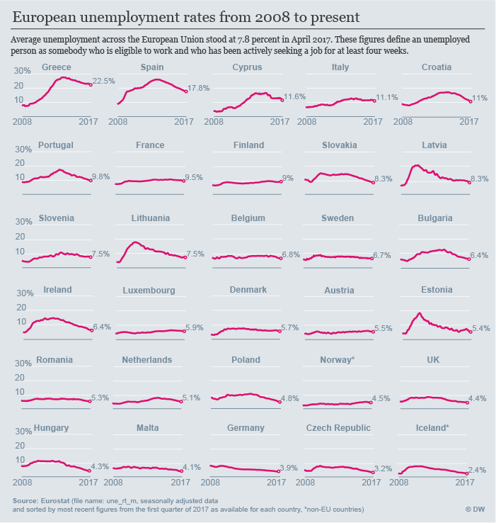

# How has unemployment evolved since Europe's economic crisis?

### Data source

Eurostat [une_rt_m](http://appsso.eurostat.ec.europa.eu/nui/show.do?dataset=une_rt_m&lang=en)

### Definitions
[Eurostat Metadata:](http://ec.europa.eu/eurostat/cache/metadata/en/une_esms.htm)
"Unemployed persons are all persons 15 to 74 years of age (16 to 74 years in ES, IT and the UK)"

"The unemployment rate is the number of people unemployed as a percentage of the labour force. The labour force is the total number of people employed and unemployed. In the database, unemployment rates can be downloaded by chosing the unit "PC_ACT", Percentage of Active Population."

### Methodology

Data used for this visual:
- Indicator: Seasonally adjusted data (not calendar adjusted)
- Unit: Percentage of active population
- Time: since 2008-01

Visualized with Python as small multiples, using [code by Jonathan Soma](http://jonathansoma.com/lede/data-studio/classes/small-multiples/long-explanation-of-using-plt-subplots-to-create-small-multiples/)

### Output

